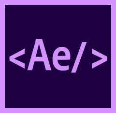

<p align="center">
	
</p>
<p align="center">Modern developer experience for After Effects scripting</p>

## What and why

Adobe ExtendScript which is used to create scripts for After Effects and other Adobe applications still runs on ES3 which is a real pain to work with. Also the experience of building user interfaces in ExtendScript is far from satisfying.

AfterScript is a framework inspired by modern JavaScript web frameworks such as React that attempts to fix this issue.

## What AfterScript gives you

- Modern JavaScript syntax
- Declarative component-based UI
- Build tool
- Tree shaking
- Minification

## Show me the code

AfterScript uses React-like JSX (not to be confused with Adobe's meaning of "JSX") - an HTML-like syntax for defining elements.

Here's how creating interfaces used to look like in ExtendScript:

```javascript
function myScript(thisObj) {
	// A function declaration inside a function, what?
	function buildUI(thisObj) {
		var myPanel = (thisObj instanceof Panel) ? thisObj : new Window("palette", "Old School Panel");
		
		var group = myPanel.add('group');
		group.orientation = 'vertical'; // Who uses horizontal groups anyway

		group.add('statictext', undefined, 'Hello, ExtendScript!'); // Directly passing undefined, everyone loves it
		var button = group.add('button', undefined, 'Click Me'); // How many of these variables we're gonna end up having?
		button.onClick = function(event) {
			alert('Something happened!');
		}

		return myPanel;
	}

	var scriptPanel = buildUI(thisObj);

	// Finally it's time to show the window
	if ((scriptPanel !== null) && (scriptPanel instanceof Window)) {
		scriptPanel.center();
		scriptPanel.show();
	}
}

// Passed references to "this", oh my
myScript(this);

```

Now, here's how the exact same hello world script is written in AfterScript:

```jsx
import { Group, Button, Text, UI } from 'afterscript';

const ScriptUI = (
	<Group>
		<Text>Hello, ExtendScript!</Text>
		<Button onClick={(event) => alert('Something happened!')} />
	</Group>
);

const win = UI.createWindow(ScriptUI, 'New Shiny Panel', 'palette');
UI.showWindow(win);

```

That's it! That's almost 1/3 of the original code!

And you get all the good stuff that comes with modern JS out of the box like `Array.forEach`, `console.log`, `setTimeout`/`setInterval`, etc.

## Getting Started

To get started, install AfterScript from NPM:

```bash
npm install -g afterscript
# or
yarn global add afterscript
```

Once installed, create a folder and initialize a new project:

```bash
mkdir my-script
cd my-script
afterscript init
# In a few moments AfterScript will generate a starter template and 
npm install # install dependencies
```

And you are all set! To build the script simply run `npm run build` (or `npm run build-production` for minified version).

## JSX and Components Guide

If you are familiar with React, you should feel right at home with AfterScript. If this syntax is freaking you out, don't worry! It's not that hard at all.

Here's a [quick introduction](https://reactjs.org/docs/introducing-jsx.html) from React that should give you a decent understanding of how it works on the web.

But in AfterScript it's a little different, though the same concepts still apply.

### Built-in Components

AfterScript provides components for every native UI element in ExtendScript. Here's a full list:

```js
Group,
Panel,
Text,
StaticText,
Button,
IconButton,
Checkbox,
Radio,
Dropdown,
Progress,
ProgressBar, // alias of Progress
Image,
Input,
EditText, // alias of Input
Slider,
Scrollbar,
Tabs,
TabbedPanel, // alias of Tabs
Tab,
ListBox,
TreeView,
TreeNode,
ListItem
```

Here's how we can create a panel with a text, button and a progress bar in AfterScript:

```jsx
import { Panel, Text, Button, Progress } from 'afterscript';

<Panel title="My Awesome Panel">
	<Text>I am a text</Text>
	<Button onClick={() => alert('Pew!')}>I am a button</Button>
	<Progress value={50} />
</Panel>

```

This will effectively de-sugar into the following:

```js
var panel = window.add('panel', undefined, 'My Awesome Panel');
panel.add('text', undefined, 'I am a text');

var button = panel.add('button', undefined, 'I am a button');
button.onClick = function() {
	alert('Pew!');
}
var progress = panel.add('progressbar');
progress.value = 50;
```

Not that hard, right? :) 

Now, notice what happens with `Button`'s `onClick` prop and `Progress`'s `value` prop. Everything you specify as props will be passed through to created nodes, so you can do anything you could do before to created elements, but in a much nicer way.

### Custom components

The biggest beauty of a component-based UI is... wait for it... components! With AfterScript you can create reusable UI components easily like so:

```jsx
import { Panel, Text, Button, Fragment } from 'afterscript'

// Component is simply a function that takes "props" and returns a JSX element:
const MyComponent = (props) => {
	return (
		<Fragment>
			<Text>{props.text}</Text>
			<Button title={props.buttonName} onClick={props.onButtonClick} />
		</Fragment>
	);
}

const ScriptUI = (
	<Panel title="Components">
		<MyComponent
			text="I am text #1"
			buttonName="Button 1"
			onButtonClick={() => alert('First button clicked!')}
		/>
		<MyComponent
			text="I am text #2"
			buttonName="Button 2"
			onButtonClick={() => alert('Second button clicked!')}
		/>
	</Panel>
);

```

#### What's up with `<Fragment>`?

The rule of JSX is that you can only pass around one element.

```jsx

// This wouldn't work
const Stuff = (
	<Text>Some text</Text>
	<Text>More Text</Text>
);

// We need to enclose multiple elements:
const Stuff = (
	<Group>
		<Text>Some text</Text>
		<Text>More Text</Text>
	</Group>
);

```

However since groups in ExtendScript can behave very unpredictably, you may not want to enclose elements in a group. This is where `Fragment` component comes in handy. It will simply pass through all the children inside of it to an above parent without adding any enclosing UI elements to the layout.

### Component Refs

Now, there are cases when you need to peek behind the magic and manipulate the node that was created some time after it has been created. For this purpose, AfterScript has React-like functional references. Here's how it works:

```jsx
import { Group, Button, Text, UI } from 'afterscript';

let textRef; // We'll store our text node here

const ScriptUI = (
	<Group>
		<Text ref={ref => textRef = ref}>Hello, ExtendScript!</Text>
		<Button
			onClick={(event) => {
				textRef.text = 'Woohoo!';
			}}
		/>
	</Group>
);

const win = UI.createWindow(ScriptUI, 'New Shiny Panel', 'palette');
// After UI.createWindow has been called, the ref is assigned and we can now get
// our `statictext` node in the "textRef" variable we created
UI.showWindow(win);
```

A ref is a function that get's called with the created UI node as an argument. This is the exact same object as you would get when doing:

```js
var textRef = window.add('statictext', undefined, 'My Text');
```

### Dimensions and directions

AfterScript provides 2 helpful props to manage your layout - `dimensions` and `horizontal`;

By default, both Group and Panel components in AfterScript will render their content vertically. To render items horizontally instead, do the following:

```jsx
<Group horizontal>
	...
</Group>
```

You can also specify `dimensions` prop like so:

```jsx
<Panel dimensions={[0, 0, 400, 200]}>
	...
</Panel>
```

## Working with images

When you generated a project, you may have noticed that AfterScript created a `data` folder. This is where you sould put your images. You can then reference them by their path inside the `data` folder:

```jsx
// Let's say we have a "data/logo.png" file
import { Image } from 'afterscript';

const ScriptUI = (
	<Image path="logo.png" />
);
```

## Building your script

To build your script, simply run:

```bash
npm run build
# Or if you want minified production output:
npm run build-production
```

### Generating .jsxbin

AfterScript can't generate `.jsxbin` files automatically. To do that, open `dist/<your-script>.jsx` in ExtendScript Toolkit after building and export it as JSXBin manually.

## Contributing

Bug reports and contributions are welcome!
